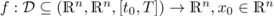

# A (Mostly) Python Based Transient Simulator for DAEs from Gas Transmission Networks

(mostly) python based simulator for gas networks

## Table Of Contents

1. [Dependencies](#deps)
2. [Preparation](#preps)
3. [First Use](#first)
4. [On the Math](#maths)
5. [License Info](#licens)
6. [Branch Name Policyof Master](#hint)

## <a name="deps">Dependencies</a>

**Note 1**: So far this software has been run on several computers with *Ubuntu* installation. Therefore it is unclear wether and how the dependencies and/or the preparational steps may change for other *operating systems*. 

**Note 2**: Down the path: "*git-root-folder*/src/ad/cycADa/" you will find **cycADa** which is multi language (involving: **python**, **cython**, **c++**) sub-package and also has some additional dependencies on its own (see -> [Preparation](#preps)).

The following Python Packages need to be installed:

### data reader

- lxml
- xmltodict
- pyyaml

### scipy-stack

- numpy
- scipy
- matplotlib

### Qt related

- pyqtgraph
- PyQt5

## <a name="preps">Preparation</a>

To set up the simulator you have to prepare the dependencies first and then:

1. the simulator or more specifically the herein contained implementation for Newton requires first order derivatives. 
These are computed by **cycADa** which is **cython** and **c++** software in parts and therefore needs to be compiled. 
So follow the path: "*git-root-folder*/src/ad/cycADa/" to the README.md in there.
2. add the "*git-root-folder*/" to your PYTHONPATH

## <a name="first">First Use - The Demo Network</a>
For both checking that the preparation of the simulator was successfull as well as to make yourself familiar on how to use the simulator a data set consisting of

 - a net topology as *.net.yaml
 - an initial value as *.inic.csv
 - a scenario as *.scenario.csv

is contained part of this git repository
 
## <a name="maths">BRIEF Mathematical Excerpt of the Simulator Software</a>

A gas network is represented as a system of differential algebraic equations 
with initial value conditions and in so called standart form 
(short: <a name="DAE">DAE</a>), i.e.


where   . 
This [DAE](#DAE) is created from a directed graph. 
The nodes represent entries, exists (i.e. where gas is pushed into or taken from the network) as well as junctions (intersections of various gas network elements such as pipes, valves, etc.)

## <a name="licens">License Information</a>

see LICENSE file

## <a name="hint">Branch Name Policy 'Master'-branch At GitHub And At Home</a>

This "master"-branch on the _github repository_ is maintained as 
"github_master" at the _home repository_. 
So for users that does not directly work with clones from the _github repository_ 
please specify exactly your push and pull destinations/origins. I.e. use
* to push to _github repository_: ```git push github github_master:master```
* to pull from _github repository_: ```git pull github master:github_master```
* to push to _home repository_: ```git push origin github_master:github_master```
* to pull from _home repository_: ```git pull origin github_master:github_master```
