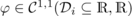
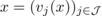
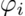
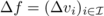

# cycADa - _cython based algorthmic differentiation_

## Table Of Contents

1. [About cycADa](#about)
2. [On the Math](#maths)
3. [On the Installation](#install)
4. [Just After the Installation](#post_install)
5. [(some) Troubleshooting](#trouble)
6. [(some related) References](#refs)

## <a name="about">About cycADa</a>

__cycADa__ (or _cython based algorthmic differentiation_) 
is a tool for _algorithmic (smooth and piecewise)
differentiation_ (sometimes also refered to as 
_automatic (smooth and piecewise) differentiation_) by 
operator overloading in __c++__ for the use in __python__ 
(i.e. __cycADa__ can be used in either language, but it was primarily developed 
and tuned for the use in __python__).

__cycADa__ offers _1st order_ _sparse_ _forward mode_ for the computation of 
 * secant __CSR__-matrices
 * Jacobian __CSR__-matrices (__note__: special case of secant mode)
 * _secant_ piecewise linear operators in block __CSR__-matrix form
   referred to as _Abs-Linear Form_ or ALF
   (__note__: for piecewise differentiable functions)
 * _tangent_ piecewise linear operators in block __CSR__-matrix form 
   referred to as _Abs-Linear Form_ or ALF
   (__note__: for piecewise differentiable functions and special case
   of secant mode)

By __CSR__ we refer to sparse matrices in the so called and well known 
_compressed sparse row_ format. 

Additionally and as more recent feature __cycADa__ also offers 
 * _secant forward_ smooth directional differentiation
 * _tangent forward_ smooth directional differentiation 
   (__note__: special case of secant mode)
 * _secant forward_ piecewise smooth directional differentiation
   (__note__: for piecewise differentiable functions)
 * _tangent forward_ piecewise smooth directional differentiation
   (__note__: for piecewise differentiable functions and special case
   of secant mode)
 * _secant reverse_ smooth directional differentiation 
   (__note__: _reverse_ mode does not exist in the piecewise smooth setting)
 * _tangent reverse_ smooth directional differentiation 
   (__note__: _reverse_ mode does not exist in the piecewise smooth setting
   and special case of secant mode)

Examples on the use of __cycADa__ from __python__ can be found 
within the /ad/cycADa/examples folder.

At its core __cycADa__ is a __c++__ program with a __cython__ shell around
to make it callable/executable/importable from __python__.
Thus the __c++__ parts need to be compiled prior first use!
As of yet there is no install option to install/configure __cycADa__ globally 
(consider it a feature). 

## <a name="maths">BRIEF Mathematical Excerpt on the Algorithmic Piecewise Differentiation of cycADa</a>

> As a general __note__: if you look for a comprehensive introduction on (smooth) 
> _algorithmic_ or _automatic differentiation_ see e.g. [Grie2008](#Grie2008). It 
> serves as theoretical foundation for the algorithmic piecewise linearization 
> as scratched or hinted herein.

With __cycADa__ you can differentiate functions    
that are chains of so-called elementary operations
 * differentiable, unary    functions 
   with Lipschitz continuous first order derivative, 
   i.e.   
 * absolute value function
 * a binary addition    
   (__note__: binary here refers to the fact that the addition takes 
   exactly two summands)
 * as well as actually 3 more binary operations that are implemented and handled 
   by __cycADa__ directly:
      - the binary subtraction    
      - the binary multiplication    
      - the binary division    
    
   but which for the remainder of this excerpt should be understood in 
   terms of the other elementary operations:
      - _subtraction_ (via _addition_):   
      - _multiplication_ (via _babylonian identity_):    
        (__note__: __cycADa__ execute and differentiate multiplications 
        directly and does not use this identity! This identity is used here for 
        explanatory purpose, only.)
      - _division_ (via _multiplication_):   
        (__note__: __cycADa__ execute and differentiate divisions directly. 
        See __note__ on _multiplication_)

Thus in theory you may interpret the evaluation of such a vector-valued 
function    as a partially ordered 
vector of intermediate functions (each of them advancing by a 
single elementary operation)

Here the    is the so called _data dependence relation_, 
i.e.    means that the computation of    requires 
the value of    beforehand. 
Some    have no dependencies in which case they are the independent 
inputs    of the function whereas 
some    have no successors in which case they are the 
final dependants   . 
In [Grie2013](#Grie2013) rules for piecewise linearization have been proposed

where    for two 
reference points    and 

the secant-tangent slope of the elementary function   . 

__note__: __cycADa__ rarely uses the secant-tangent slope formula directly but other 
optimized and so called 'singularity-free' formulas (see [Grie2018](#Grie2018) 
for more details).

Also in [Grie2013](#Grie2013) it has been proven for this set of 
rules for piecewise linearization that

where    is a function evaluation
and    is
the so called _increment_. This statement simplifies further into the well known 
_Theorem of Taylor for first order expansions_ namely

whenever    coalesce.

__note__: If the function    does not 
involve any absolute value operation then it already is differentiable in the classical 
meaning of _Fréchet Differentiability_, i.e.   .
In that case we already find the increment

actually to be a secant or tangent directional derivative, 
where    either 
is a secant matrix (if   ) or the 
Jacobian (if   ) of   .

Because it is often necessary to compute many increments    in
various directions    for a fixed choice the reference 
points    (e.g. for a generalized or piecewise differentiable
Newton method, see [Grie2018](#Grie2018)), 
__cycADa__ can compute secant or tangent piecewise linear operators

referred to as _Abs-Linear Form_ or _ALF_ (in older literature still _Abs-Normal Form_ or _ANF_)
that generalize the idea of secant or Jacobian matrices of a function. For more discussions
regarding the concept of _ALF_ see [Grie2015](#Grie2015) or [Streub2014](#Streub2014).
For another example on how to use piecewise linearization to integrate a system of 
ordinary differential equations with picewise differentiable 
right-hand-side system function (ODE) see [GrHa2018](#GrHa2018).

## <a name="install">On the Installation</a>

__note:__ This installation process was successful many times on __Ubuntu__. 
Someone gave positive feedback for installing on __MacOs__. 
There is no experience for __Windows__ so far!

Make sure to have the following dependencies installed:
 * __cython__
 * __g++__ 
 * __boost__ (c++ libraries)
 * __numpy__
 * __scipy__
 * __pyyaml__

There is a __Makefile__ organizing the installation process:
 1. open __bash__ (or any other shell)
 2. _cd_ your way to .../ad/cycADa/
 3. _execute_ or _call_
    
        make
    
    and follow the instructions

Alternatively (and since there is a setup.py) you can install __cycADa__ e.g.
as you wish and need.

## <a name="post_install">Just after the Installation</a>

Once the __Makefile__ completed its task __cycADa__ is ready to 
use already (-> check .../ad/cycADa/examples).
if you want to use __cycADa__ within your project you will need to 
add __cycADa__ (or more specifically the parent folder of 'ad/') to the __PYTHONPATH__ 
in some way or another. In case you want to extend the __PYTHONPATH__ variable
manually you can e.g. follow:
  
 4. open __bash__
 5. _execute_:
     
        export PYTHONPATH="${PYTHONPATH}:/<path parent folder of 'ad/'>/"
   
## <a name="refs">(some related) References</a>
 * <a name="Grie2008">[Grie2008]</a> Andreas Griewank & Andrea Walther (2008) Evaluating Derivatives: 
   Principles and Techniques of Algorithmic Differentiation - Second Edition,
   Society for Industrial and Applied Mathematics, DOI: 10.1137/1.9780898717761
 * <a name="Grie2013">[Grie2013]</a> Andreas Griewank (2013) On stable piecewise linearization and 
   generalized algorithmic differentiation, Optimization Methods and Software, 
   28:6, 1139-1178, DOI: 10.1080/10556788.2013.796683
 * <a name="Grie2018">[Grie2018]</a> Andreas Griewank, Tom Streubel, Lutz Lehmann, 
   Manuel Radons & Richard Hasenfelder (2018) Piecewise linear secant approximation 
   via algorithmic piecewise differentiation, Optimization Methods and Software, 
   33:4-6, 1108-1126, DOI: 10.1080/10556788.2017.1387256
 * <a name="Grie2015">[Grie2015]</a> Andreas Griewank, Jens-Uwe Bernt, Manuel Radons & Tom 
   Streubel (2015) Solving piecewise linear systems in abs-normal form, Linear 
   Algebra and its Applications, Volume 471, Pages 500-530, ISSN 0024-3795,
   DOI: 10.1016/j.laa.2014.12.017
 * <a name="Streub2014">[Streub2014]</a> Tom Streubel, Andreas Griewank, Manuel Radons & Jens-Uwe 
   Bernt (2014) Representation and Analysis of Piecewise Linear Functions 
   in Abs-Normal Form, In: Pötzsche C., Heuberger C., Kaltenbacher B., 
   Rendl F. (eds) System Modeling and Optimization, CSMO 2013, IFIP Advances in 
   Information and Communication Technology, vol 443. Springer, 
   Berlin, Heidelberg, DOI: 10.1007/978-3-662-45504-3_32
 * <a name="GrHa2018">[GrHa2018]</a> Andreas Griewank, Richard Hasenfelder, Manuel Radons, 
   Lutz Lehmann & Tom Streubel (2018) Integrating Lipschitzian dynamical 
   systems using piecewise algorithmic differentiation, Optimization Methods 
   and Software, 33:4-6, 1089-1107, DOI: 10.1080/10556788.2017.1378653
   